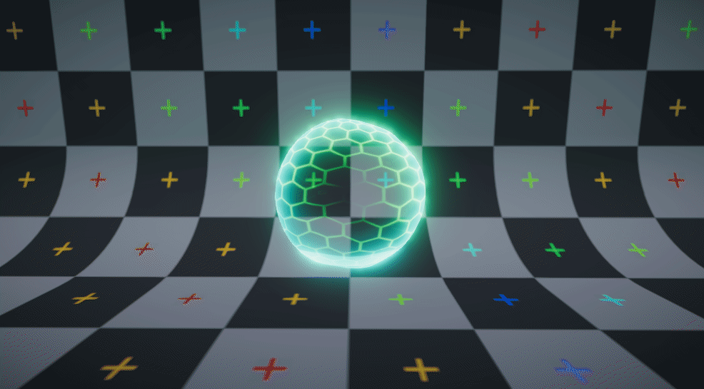

# HoloShield   

_WORK IN PROGRESS_

The shader can be edited through [Amplify Shader Editor](http://amplify.pt/unity/amplify-shader-editor) and contributions to the project are always welcome!

---

Project developed using **Unity 2018.3.0b6**. Please use this version if you are planning on contributing. You can work on your own branch and send a pull request with your changes.

---

You can also just download a **unitypackage** from the [releases tab](https://github.com/AdultLink/HoloShield/releases) and easily import everything to your project. This will not download the _media_ folder.

_Disclaimer: The scripts controlling the behavior of the examples provided are not optimized in any way and should only be taken as quick & dirty examples._

Free packages used:

# License
MIT License

Copyright (c) 2018 Guillermo Angel

Permission is hereby granted, free of charge, to any person obtaining a copy
of this software and associated documentation files (the "Software"), to deal
in the Software without restriction, including without limitation the rights
to use, copy, modify, merge, publish, distribute, sublicense, and/or sell
copies of the Software, and to permit persons to whom the Software is
furnished to do so, subject to the following conditions:

The above copyright notice and this permission notice shall be included in all
copies or substantial portions of the Software.

THE SOFTWARE IS PROVIDED "AS IS", WITHOUT WARRANTY OF ANY KIND, EXPRESS OR
IMPLIED, INCLUDING BUT NOT LIMITED TO THE WARRANTIES OF MERCHANTABILITY,
FITNESS FOR A PARTICULAR PURPOSE AND NONINFRINGEMENT. IN NO EVENT SHALL THE
AUTHORS OR COPYRIGHT HOLDERS BE LIABLE FOR ANY CLAIM, DAMAGES OR OTHER
LIABILITY, WHETHER IN AN ACTION OF CONTRACT, TORT OR OTHERWISE, ARISING FROM,
OUT OF OR IN CONNECTION WITH THE SOFTWARE OR THE USE OR OTHER DEALINGS IN THE
SOFTWARE.
