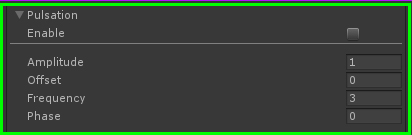

# HoloShield    

This shader can be edited through [Amplify Shader Editor](http://amplify.pt/unity/amplify-shader-editor) and contributions to the project are always welcome!

---

Project developed using **Unity 2018.3.0b6**. Please use this version if you are planning on contributing. You can work on your own branch and send a pull request with your changes.

---

You can also just download a **unitypackage** from the [releases tab](https://github.com/AdultLink/HoloShield/releases) and easily import everything to your project. This will not download the _media_ folder.

_Disclaimer: The scripts controlling the behavior of the examples provided are not optimized in any way and should only be taken as quick & dirty examples._

Third-party (free) assets used in this project:
- [FREE Skybox - Cubemap extended, by BOXOPHOBIC](https://assetstore.unity.com/packages/vfx/shaders/free-skybox-cubemap-extended-107400)
- [Kenney.nl particle pack](https://kenney.nl/assets/particle-pack)
- [Barbarian warrior, by ADVANCEDSKELETON](https://assetstore.unity.com/packages/3d/characters/humanoids/barbarian-warrior-75519)
- [Speedball player, by CHARACTER INK](https://assetstore.unity.com/packages/3d/characters/humanoids/speedball-player-12980)

# Table of contents
1. [Getting started](#getting-started)
2. [Usage & parameters](#usage-parameters)
    - 2.1 [Fresnel](#fresnel)
    - 2.2 [Texture](#texture)
    - 2.3 [Noise](#noise)
    - 2.4 [Distortion](#distoriton)
    - 2.5 [Pulsation](#pulsation)
    - 2.6 [Tessellation](#tessellation)
3. [Examples](#examples)
4. [Donate](#donate)
5. [License](#license)

# Getting started
Setup is minimal, just drop a material with onto a default unity sphere and you already have your holo shield. Other than that it's just playing around with parameters to achieve desired look.

# Usage, parameters

This shader is comprised of a few "modules", that work independently and can be activated/deactivated without affecting each other.

## Fresnel

This shader provides several ways to customize the final look of your sci-fi shield, and the main/base look is achieved through the fresnel effect.

Fresnel settings determine the `Scale`, `Color` and `Power` of the "edge". How far and how bright the edge extends towards the inside. Modifying `Bias` is rarely needed.

Default values for `Inner opacity` and `Edge opacity` are 0 and 1 respectively. It means the area covered by the fresnel effect is fully visible, whereas the area not covered by it is completely invisible. Inverting these values results in an invisible edge, and a fully visible interior.

_For more information on the Fresnel effect check [this](https://www.dorian-iten.com/fresnel/)_.

## Texture

But just a simple edge is quite boring, isn't it?

Add up to two textures that can be made to scroll (`Panning speed`) in any direction to achieve a more dynamic look. Even the simplest of textures can look good.

Tweak their `Intensity`, `Tint` color or `Invert` them. _Important to note: all textures will be converted to grayscale and then tinted._

In this case, we've got a slow honeycomb pattern as the main texture, and a simple horizontal stripe for a fast sweeping effect.

## Noise

In addition to these textures, we can also add some procedural noise for a gritty look. Alternatively, we can sharpen it and go for a stylized look:

## Distortion

This is what makes this shader interesting, because we don't always want a completellyperfect sphere, that's rather boring.

Play around with `Scale` and `Extra roughness` to achieve the desired look and then animate the surface by giving it some `Speed`.

This example showcases high amplitude, low frequency distortion versus low amplitude, high frequency distortion:

## Pulsation

Pretty self-explanatory, make it dance!

A sine wave controls the scale, and thus you can tweak its `Amplitude`, `Frequency` and `Phase`, as well as the `Offset`.

## Tessellation

Tessellation helps achieve a higher resolution when the amount of distortion we apply is too much in comparison to the amount of vertices of our mesh.

At the beginning of this document, we mentioned we are using built-in Unity spheres, but these spheres are relatively low-poly, and thus not detailed enough for high frequency distortion.

Tessellation allows us to subdivide the mesh so that there are more vertices in between the original ones.

_For more information on Tessellation, check [this](https://en.wikipedia.org/wiki/Tessellation_(computer_graphics))._

This example shows the same base mesh and distortion settings, but different tessellation. The one on the right is much more high-res because there are more vertices to push around.

You can really appreciate the difference these settings make by switching to 'Wireframe' or 'Shaded wireframe' modes under 'Scene display mode' (next to the 3D/2D toggle button).

## Examples

Of course you can use your own meshes, remember to set UVs according to the effect you want to achieve.

# License
MIT License

Copyright (c) 2018 Guillermo Angel

Permission is hereby granted, free of charge, to any person obtaining a copy
of this software and associated documentation files (the "Software"), to deal
in the Software without restriction, including without limitation the rights
to use, copy, modify, merge, publish, distribute, sublicense, and/or sell
copies of the Software, and to permit persons to whom the Software is
furnished to do so, subject to the following conditions:

The above copyright notice and this permission notice shall be included in all
copies or substantial portions of the Software.

THE SOFTWARE IS PROVIDED "AS IS", WITHOUT WARRANTY OF ANY KIND, EXPRESS OR
IMPLIED, INCLUDING BUT NOT LIMITED TO THE WARRANTIES OF MERCHANTABILITY,
FITNESS FOR A PARTICULAR PURPOSE AND NONINFRINGEMENT. IN NO EVENT SHALL THE
AUTHORS OR COPYRIGHT HOLDERS BE LIABLE FOR ANY CLAIM, DAMAGES OR OTHER
LIABILITY, WHETHER IN AN ACTION OF CONTRACT, TORT OR OTHERWISE, ARISING FROM,
OUT OF OR IN CONNECTION WITH THE SOFTWARE OR THE USE OR OTHER DEALINGS IN THE
SOFTWARE.
